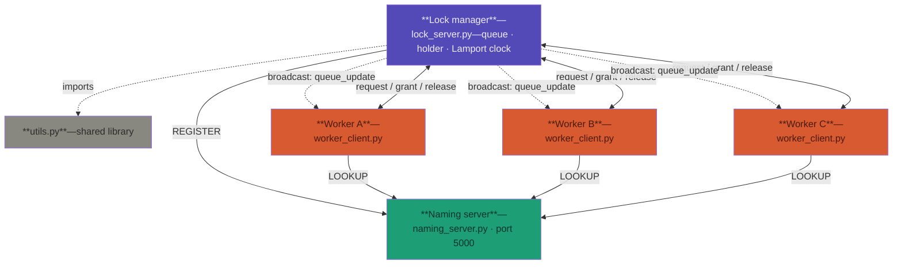

![[distributed_system_architecture.svg]]




The `<-->` bidirectional arrows handle request/grant on a single edge. Dashed lines ( `-.->`) distinguish broadcasts and the `utils.py` import from the main TCP message flow.

## How the system works

There are three kinds of process. Each is a separate Python program.

---

### 1. Naming server (`naming_server.py`)

Starts first and stays running. Acts as a directory: it maps a logical name (`lock.server.main`) to a physical address (`ip:port`). The Lock Manager registers its address here on startup. Workers look it up. After that, the Naming Server is not involved again.

Its port is the only hardcoded value in the system.

---

### 2. Lock manager (`lock_server.py`)

The central engine. It maintains three pieces of state:

- `lock_queue` — a priority queue of pending requests, sorted by `(timestamp, worker_id)`
- `lock_holder` — which worker currently holds the lock
- `lamport_clock` — its own logical clock

When a `request_lock` message arrives, it updates its clock (Lamport Rule 3), inserts the request into the queue, and grants the lock to whoever is at the front. When `release_lock` arrives, it removes that worker and grants to the next in line. It broadcasts `queue_update` to all connected workers after every change.

It runs one thread per connected worker (for reading messages) plus a main accept loop. All access to shared state is protected by a `threading.Lock()`.

---

### 3. Worker client (`worker_client.py`)

Each worker is an interactive terminal. On startup it resolves the Lock Manager's address via the Naming Server, connects over TCP, and sends a `hello` message. It then runs two concurrent threads:

- **Listener thread** — receives broadcasts from the Lock Manager (queue position, lock granted/released)
- **Main thread** — handles user input (request lock, use resource, release lock)

The worker maintains its own Lamport clock and attaches its current timestamp to every `request_lock` message.

---

### 4. Shared library (`utils.py`)

Imported by all three programs. Provides:

- `LamportClock` — thread-safe, with `tick()`, `send()`, `receive(ts)` methods
- `send_json` / `recv_json` — handles message framing over TCP (length-prefix header, because TCP is a stream, not a message protocol)
- Message type constants

---

### Startup order

```
1. naming_server.py      ← must be first
2. lock_server.py        ← registers itself; must be up before workers
3. worker_client.py × N  ← any order, any number
```

