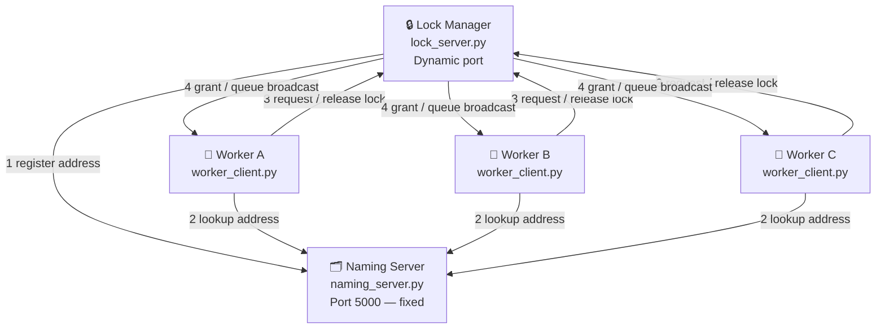
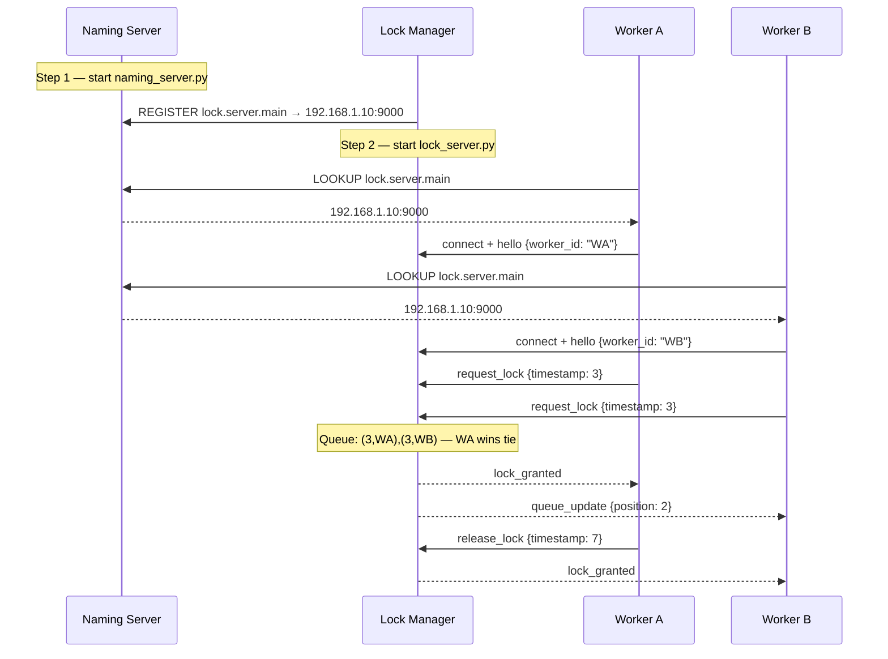

# DCRLM — Complete Overview & Next Steps

---

## The Problem

You are simulating a datacenter where multiple worker machines compete for exclusive access to a shared resource (a GPU, a database, etc.). The challenge is doing this _fairly_ across a network where:

- Machines have no shared clock — you cannot trust timestamps from different computers
- Machines have no shared memory — they can only communicate by sending messages
- Messages can arrive out of order due to network delay

Without a solution, two workers could both think they have access to the resource at the same time. That is a **race condition**, and it corrupts whatever the resource holds.

---

## The Solution

Build three cooperating programs that together enforce a rule: **only one worker may hold the lock at any moment, and the order is determined fairly using logical time, not physical time.**

The three pillars of the solution map directly to the three graded requirements:

|Pillar|Problem it solves|Mechanism|
|---|---|---|
|Naming|Workers cannot hardcode server addresses|A directory server resolves logical names to IPs|
|Messaging|Machines can only communicate via network|JSON messages over TCP sockets|
|Synchronization|Physical clocks cannot order events fairly|Lamport Logical Clocks on every node|

---

## Core Concepts

**Lamport Clock** — a counter, not a clock. Every node maintains an integer. Before sending a message, increment and attach it. On receiving a message, take the max of yours and the received value, then add 1. This guarantees that if event A caused event B, A's timestamp is always lower. Two events with equal timestamps are broken by worker ID (alphabetical). This is the entire basis of fairness in the system.

**Mutual Exclusion** — the lock queue. When a worker wants the resource, it sends a request with its Lamport timestamp. The Lock Manager keeps all pending requests in a priority queue sorted by `(timestamp, worker_id)`. The worker at the front gets the lock. Everyone else waits. When the lock is released, the next in line is granted access automatically.

**Naming / Directory Service** — the Naming Server is the only process whose address is known in advance. Everything else registers its address there and looks up others there. This means you can restart the Lock Manager on a different port and workers will still find it, because they look up the name, not the address.

**Message-Oriented Communication** — no process calls functions on another process directly. Every interaction is a discrete JSON message with a `type` field. TCP delivers it reliably. Each socket connection runs in its own thread so no single slow worker blocks the rest.

---

## The Three Programs

**`naming_server.py`** — Runs first, always. Holds a dictionary of `logical name → IP:port`. Answers REGISTER and LOOKUP requests. Never goes down during a session.

**`lock_server.py`** — The core engine. Registers with the Naming Server. Accepts worker connections on separate threads. Maintains the lock queue and Lamport clock. Grants locks, broadcasts queue state, handles releases.

**`worker_client.py`** — One instance per worker. Looks up the Lock Manager via the Naming Server. Runs a listener thread for incoming broadcasts and a main thread for user input. Maintains its own Lamport clock.

**`utils.py`** — Shared library imported by all three. Contains the `LamportClock` class, `send_json()`, and `recv_json()` with proper message framing.

---

## Task Delegation

|Member|Role|Owns|Delivers|
|---|---|---|---|
|**1**|Registry Architect|`naming_server.py`|Full naming server: REGISTER, LOOKUP, re-registration on crash/restart|
|**2**|Middleware Engineer|`utils.py` — networking half|`send_json`, `recv_json`, length-prefixed framing, JSON schema definitions|
|**3**|Timekeeper|`utils.py` — clock half + queue logic inside `lock_server.py`|`LamportClock` class, queue sort, grant/release decision logic|
|**4**|Client Developer|`worker_client.py`|Terminal UI, listener thread, clock calls on send/receive|
|**5**|Server Developer & Integrator|`lock_server.py`|Accept loop, per-worker threads, integrates Member 2's sockets and Member 3's clock, leads final testing|

The dependency chain matters. Member 1 must finish first. Members 2 and 3 must finish before Members 4 and 5 can fully integrate. Plan accordingly.

---

## What Happens at Runtime — In Order

---

## Next Steps

These are ordered. Do not skip ahead — each phase unblocks the next.

**Phase 1 — Agree and set up (everyone, day 1)**

- Agree on the complete JSON message schema as a team. Write it down in a shared doc. Every field, every message type, both directions. Members 2, 4, and 5 all depend on this.
- Create a GitHub repository. One person creates it, everyone else forks or clones. Agree on a branching strategy — one branch per member is the simplest.
- Member 1 starts on `naming_server.py` immediately. It is the blocker for everything else.

**Phase 2 — Build in isolation (members work in parallel)**

- Member 1 finishes and tests the Naming Server standalone. Verify REGISTER and LOOKUP work from a raw terminal before anyone else touches it.
- Member 2 writes and tests `send_json` and `recv_json` with a minimal echo server. This framing logic must work perfectly before any real messages flow.
- Member 3 writes the `LamportClock` class and tests it with a simple script simulating two nodes exchanging messages. Also writes the queue sort function and tests it with hardcoded requests.
- Members 4 and 5 can begin their files using stubs — placeholder functions that print "TODO" — so the file structure is in place.

**Phase 3 — Wire it together (Members 2, 4, 5 integrate)**

- Member 5 builds the Lock Manager skeleton: accepts connections, reads messages using Member 2's `recv_json`, echoes them back. No lock logic yet.
- Member 4 builds the Worker: connects to the Naming Server (Member 1), resolves the address, connects to the Lock Manager (Member 5), sends a `hello`. Confirm the full path works end to end.
- Member 3 integrates the clock into both `lock_server.py` and `worker_client.py`. Add the real queue logic to the Lock Manager.

**Phase 4 — Test under real conditions**

- Run all three programs on separate terminal windows on one machine first.
- Then run on separate laptops on the same Wi-Fi. This is where real distributed issues appear.
- Add `time.sleep(2)` inside one Worker's send path to simulate network lag. Verify the Lamport-ordered queue still grants the lock in the correct logical order despite the delay. Record this test — you will need it for the demo.
- Stress test: connect five workers simultaneously and have them all request the lock at once. The system must not crash and must grant the lock to exactly one at a time.

**Phase 5 — Deliverables**

- Source code with comments explaining _why_, not just _what_. The grader reads comments.
- Architecture diagram — the mermaid and SVG diagrams above are a starting point. Redraw them cleanly for the report.
- Final report in DOCX. Introduction, one section per pillar, one reflection paragraph per member.
- Rehearse the live demo at least once before the presentation. Know the startup order cold. Have a backup plan if one laptop fails — the whole system can run on one machine with three terminals.