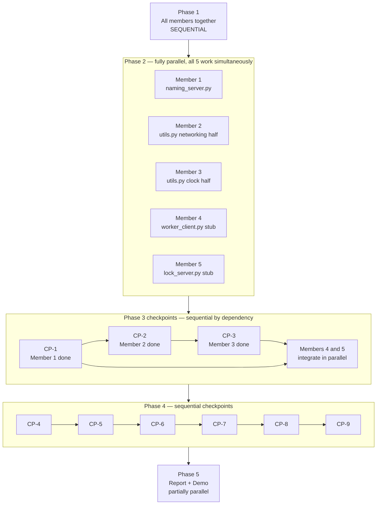

# DCRLM — Full Phase Plan

---

## Phase Overview

```mermaid
gantt
    dateFormat  D
    axisFormat  Day %d

    section Phase 1
    Architecture & Setup         :p1, 1, 2d

    section Phase 2
    Member 1 — Naming Server     :p2m1, 3, 2d
    Member 2 — utils networking  :p2m2, 3, 2d
    Member 3 — utils clock       :p2m3, 3, 2d
    Member 4 — client stub       :p2m4, 3, 2d
    Member 5 — server stub       :p2m5, 3, 2d

    section Phase 3
    CP-1 naming server           :p3cp1, 5, 1d
    CP-2 framing                 :p3cp2, 5, 1d
    CP-3 clock                   :p3cp3, 5, 1d
    Member 4 — full client       :p3m4, 6, 2d
    Member 5 — full server       :p3m5, 6, 2d

    section Phase 4
    CP-4 single worker           :p4cp4, 8, 1d
    CP-5 three workers           :p4cp5, 9, 1d
    CP-6 lag test                :p4cp6, 9, 1d
    CP-7 duplicate ID            :p4cp7, 9, 1d
    CP-8 timeout watchdog        :p4cp8, 9, 1d
    CP-9 log file verify         :p4cp9, 9, 1d

    section Phase 5
    Report writing               :p5r, 10, 2d
    Demo rehearsal               :p5d, 11, 1d
    Final assembly               :p5f, 12, 1d
```



---

## Parallel vs Sequential Rules



---

## Phase 1 — Architecture and Setup

### All members. Sequential. Day 1.

All five members must complete Phase 1 together before anyone writes code. These tasks cannot be parallelized because every downstream task depends on the agreements made here.

---

### Task 1.1 — Read the shared integration spec

**Who:** All members **Parallel:** Yes — everyone reads independently **Depends on:** Nothing

Read the complete shared integration spec document. Every section. Pay special attention to the sections that govern your own component. Come to the Phase 1 meeting with questions written down.

**Deliverable:** Each member confirms in the group chat they have read the spec.

---

### Task 1.2 — Resolve the eight decisions

**Who:** All members, together **Parallel:** No — requires group agreement **Depends on:** 1.1

As a group, confirm and record the following decisions in a shared doc (Google Doc, Notion, anything everyone can edit):

- Simulation: worker writes to `resource_access.log` for 5 seconds per hold
- Lock timeout: 30 seconds, watchdog thread in Lock Manager
- Demo environment: single machine, multi-machine `config.py` backup ready
- Duplicate worker ID: Lock Manager rejects with error, Member 4 handles client-side
- Broadcast pattern: canonical code from Section 8.1 is law
- Report: ownership table from Section 21 is agreed
- Architecture diagram: exported as PNG by Member 1, embedded in DOCX by Member 5
- Demo script: owned by Member 5, rehearsed on Day 11

**Deliverable:** Decisions recorded in shared doc. Link shared in group chat.

---

### Task 1.3 — Create GitHub repository

**Who:** Member 5 **Parallel:** Can run alongside 1.2 **Depends on:** Nothing

Create a GitHub repository named `dcrlm`. Initialize with a `README.md`. Create the following branches:

```
main
member1/naming-server
member2/utils-networking
member3/utils-clock
member4/worker-client
member5/lock-server
```

Add all five members as collaborators. Set `main` as a protected branch — no direct pushes, only merges via pull request approved by Member 5.

**Deliverable:** Repository URL shared in group chat. All members have accepted the collaborator invite and can clone.

---

### Task 1.4 — Create project skeleton

**Who:** Member 5 **Parallel:** No — do after 1.3 **Depends on:** 1.3

On branch `member5/lock-server`, create the following files with only the header comment and imports. No logic yet.

```python
# naming_server.py
#!/usr/bin/env python3
# -*- coding: utf-8 -*-
# Member 1 — Registry Architect
# Naming Server: handles REGISTER and LOOKUP requests.

import socket
import threading
import sys
import argparse
from config import NAMING_SERVER_PORT
```

```python
# lock_server.py
#!/usr/bin/env python3
# -*- coding: utf-8 -*-
# Member 5 — Server Developer and Integrator
# Lock Manager: enforces distributed mutual exclusion using Lamport clocks.

import socket
import threading
import time
import sys
import argparse
from utils import LamportClock, send_json, recv_json, sort_queue, build_queue_update_msg
from utils import simulate_resource_use, check_lock_timeout, get_local_ip
from config import *
```

```python
# worker_client.py
#!/usr/bin/env python3
# -*- coding: utf-8 -*-
# Member 4 — Client Developer
# Worker Client: connects to Lock Manager and requests exclusive resource access.

import socket
import threading
import sys
import argparse
from utils import LamportClock, send_json, recv_json, get_local_ip
from config import *
```

```python
# utils.py
#!/usr/bin/env python3
# -*- coding: utf-8 -*-
# Member 2 — send_json, recv_json, get_local_ip
# Member 3 — LamportClock, sort_queue, build_queue_update_msg,
#             simulate_resource_use, check_lock_timeout

import socket
import threading
import json
import struct
import time
from config import *
```

Also create `config.py` with the full contents from Section 2 of the spec and `requirements.txt` containing only the comment `# stdlib only — no pip installs needed`.

Create the `tests/` directory with three empty files: `test_clock.py`, `test_framing.py`, `test_naming.py`.

Push to `member5/lock-server`. Open a pull request into `main` titled `[SKELETON] Project structure`. Merge it immediately — this is the base everyone else branches from.

**Deliverable:** All members pull `main` and confirm the skeleton is on their machine.

---

### Task 1.5 — Each member checks out their branch

**Who:** All members **Parallel:** Yes **Depends on:** 1.4

```bash
git checkout main
git pull origin main
git checkout member1/naming-server   # replace with your branch name
```

Each member confirms their branch is clean and the skeleton files are present.

**Deliverable:** Each member confirms in group chat their branch is ready.

---

## Phase 2 — Build in Isolation

### All members work in parallel. Days 3–4.

All five tasks in Phase 2 run fully in parallel. No member depends on another's output during this phase. Each member works only on their own branch.

---

### Member 1 — Tasks 2.1 through 2.5

#### Task 2.1 — Implement `handle_register`

**File:** `naming_server.py` **Depends on:** 1.5 **Parallel with:** All other Phase 2 tasks

Implement the `handle_register` function. It receives a list of tokens parsed from the incoming line. It acquires `registry_lock`, writes `registry[name] = (ip, int(port))`, releases the lock, and returns the string `"OK"`.

Edge cases to handle:

- Fewer than 4 tokens: return `"ERROR malformed REGISTER request"`
- Port is not a valid integer: return `"ERROR invalid port"`
- Name already exists: overwrite silently — this is re-registration, not an error

```python
# prompt for AI:
# Implement handle_register(tokens, registry, registry_lock) in Python.
# tokens is a list like ["REGISTER", "lock.server.main", "192.168.1.10", "9000"].
# Acquire registry_lock, update the registry dict, release, return "OK".
# Handle malformed input by returning an error string.
# Use threading.Lock as registry_lock.
```

**Deliverable:** Function implemented with inline comments on every logical step.

---

#### Task 2.2 — Implement `handle_lookup`

**File:** `naming_server.py` **Depends on:** 2.1 **Sequential after:** 2.1 (shares registry structure)

Implement `handle_lookup`. Acquires `registry_lock`, reads `registry.get(name)`, releases lock. Returns `"FOUND ip port"` if found, `"NOT_FOUND"` if not.

```python
# prompt for AI:
# Implement handle_lookup(tokens, registry, registry_lock) in Python.
# tokens is like ["LOOKUP", "lock.server.main"].
# Acquire registry_lock, read registry dict, release.
# Return "FOUND 192.168.1.10 9000" if name exists, "NOT_FOUND" otherwise.
# Handle fewer than 2 tokens as an error.
```

**Deliverable:** Function implemented and manually verified by calling it directly in a `__main__` block with hardcoded test inputs.

---

#### Task 2.3 — Implement `handle_client`

**File:** `naming_server.py` **Depends on:** 2.1, 2.2 **Sequential after:** 2.2

Implement `handle_client`. This runs in a thread. It reads one line from the connection, strips whitespace, splits into tokens, checks the first token to dispatch to `handle_register` or `handle_lookup`, sends the response back, closes the connection.

```python
# prompt for AI:
# Implement handle_client(conn, addr, registry, registry_lock) in Python.
# Runs in a thread. Reads one newline-terminated line from conn.
# Splits into tokens. Dispatches to handle_register or handle_lookup.
# Sends the response string back followed by \n. Closes conn.
# Wraps everything in try/except OSError to handle abrupt disconnects.
# Logs each request using the [NS][--] format from Section 11.
```

**Deliverable:** Function implemented with logging on every branch.

---

#### Task 2.4 — Implement `start_naming_server`

**File:** `naming_server.py` **Depends on:** 2.3 **Sequential after:** 2.3

Implement the main entry point. Creates the registry dict and lock. Binds a TCP socket to `host:port`. Sets `SO_REUSEADDR`. Calls `socket.listen(MAX_CONNECTIONS)`. Enters an infinite accept loop, spawning a daemon thread per connection calling `handle_client`. Prints the ready line from Section 20.

```python
# prompt for AI:
# Implement start_naming_server(host, port) in Python.
# Create registry = {} and registry_lock = threading.Lock().
# Bind TCP socket to host:port with SO_REUSEADDR.
# Enter infinite loop: accept connection, spawn daemon thread running handle_client.
# Print "[NS][--] Naming Server ready on port {port}" after bind succeeds.
# Handle KeyboardInterrupt cleanly by closing the server socket and exiting.
```

**Deliverable:** Naming Server starts, prints ready line, accepts connections.

---

#### Task 2.5 — Implement `argparse` entry and write `tests/test_naming.py`

**File:** `naming_server.py`, `tests/test_naming.py` **Depends on:** 2.4 **Sequential after:** 2.4

Add the `argparse` block at the bottom of `naming_server.py` per the CLI spec in Section 13. Then write all four test functions in `test_naming.py` per Section 21. Tests must not use real sockets — use `socket.socketpair()` or spin up a real server on a random port in a thread.

```python
# prompt for AI:
# Write test_register_and_lookup, test_lookup_missing, test_re_register,
# and test_concurrent_requests for the naming server in Python.
# Start the naming server on a random available port in a background thread.
# Use real TCP connections to send REGISTER and LOOKUP lines and assert responses.
# test_concurrent_requests spawns 10 threads each registering a different name,
# then verifies all 10 resolve correctly.
```

**Deliverable:** `python tests/test_naming.py` runs and all four tests print PASS.

---

### Member 2 — Tasks 2.6 through 2.9

#### Task 2.6 — Implement `send_json`

**File:** `utils.py` **Depends on:** 1.5 **Parallel with:** All other Phase 2 tasks

Implement `send_json(sock, msg)`. Serialize `msg` to a UTF-8 JSON string. Pack the byte length as a 4-byte big-endian unsigned int using `struct.pack(">I", length)`. Send the header then the body using `sock.sendall()`.

```python
# prompt for AI:
# Implement send_json(sock, msg) in Python using only the standard library.
# Serialize msg dict to UTF-8 JSON bytes.
# Prepend a 4-byte big-endian unsigned int containing the byte length.
# Send header + body using sock.sendall().
# Raise ConnectionError with a descriptive message if sendall raises OSError.
```

**Deliverable:** Function implemented with inline comments explaining the wire format.

---

#### Task 2.7 — Implement `recv_json`

**File:** `utils.py` **Depends on:** 2.6 **Sequential after:** 2.6

Implement `recv_json(sock)`. Read exactly 4 bytes for the header. Unpack the length. Read exactly that many bytes in a loop (TCP may fragment). Deserialize and return.

The loop is critical — do not use a single `sock.recv(n)` call for the body because TCP does not guarantee the full payload arrives in one chunk.

```python
# prompt for AI:
# Implement recv_json(sock) in Python using only the standard library.
# Read exactly 4 bytes from sock to get the big-endian uint32 message length N.
# Then read exactly N bytes using a loop: keep calling sock.recv() and
# appending to a buffer until len(buffer) == N.
# If recv() returns 0 bytes at any point, raise ConnectionError("Socket closed").
# Deserialize the buffer as UTF-8 JSON and return the dict.
# Raise ValueError if the payload is not valid JSON.
```

**Deliverable:** Function implemented. Handles partial reads correctly.

---

#### Task 2.8 — Implement `get_local_ip`

**File:** `utils.py` **Depends on:** 1.5 **Parallel with:** 2.6 and 2.7

Copy the exact implementation from Section 19 of the spec. Add the inline comments explaining why it works without sending real traffic.

**Deliverable:** One function, no logic changes from the spec.

---

#### Task 2.9 — Write `tests/test_framing.py`

**File:** `tests/test_framing.py` **Depends on:** 2.6, 2.7 **Sequential after:** 2.7

Write all four test functions from Section 21. Use `socket.socketpair()` to get two connected sockets without a real server.

```python
# prompt for AI:
# Write test_roundtrip_simple, test_roundtrip_unicode, test_roundtrip_large,
# and test_partial_recv for send_json and recv_json in Python.
# Use socket.socketpair() to create two connected sockets.
# test_partial_recv: monkey-patch sock.recv to return data 1 byte at a time
# and verify recv_json still reconstructs the full message correctly.
# Each test prints PASS or FAIL with a description.
```

**Deliverable:** `python tests/test_framing.py` runs and all four tests print PASS.

---

### Member 3 — Tasks 2.10 through 2.14

#### Task 2.10 — Implement `LamportClock.__init__` and `value`

**File:** `utils.py` **Depends on:** 1.5 **Parallel with:** All other Phase 2 tasks

Implement the constructor and `value()` method only. The constructor sets `self._clock = INITIAL_CLOCK_VALUE` and `self._lock = threading.Lock()`. `value()` acquires the lock, reads `self._clock`, releases, returns it.

```python
# prompt for AI:
# Implement the LamportClock class in Python with __init__ and value() only.
# __init__ sets self._clock = 0 and self._lock = threading.Lock().
# value() acquires self._lock, reads self._clock, releases, returns the int.
# Do not implement tick, send, or receive yet.
```

**Deliverable:** Class with two methods, thread-safe read confirmed by inspection.

---

#### Task 2.11 — Implement `tick`, `send`, `receive`

**File:** `utils.py` **Depends on:** 2.10 **Sequential after:** 2.10

Implement the three mutating methods. Each acquires `self._lock`, applies the rule, releases, returns the new value.

```python
# prompt for AI:
# Add tick(), send(), and receive(received_timestamp) to the LamportClock class.
# tick(): acquire lock, self._clock += 1, release, return new value.
# send(): same as tick() — increment before sending.
# receive(received_timestamp): acquire lock,
#   self._clock = max(self._clock, received_timestamp) + 1, release, return new value.
# All three must be thread-safe using self._lock.
```

**Deliverable:** All five methods implemented. Verify manually with a short script printing clock values through a sequence of tick/send/receive calls.

---

#### Task 2.12 — Implement `sort_queue` and `build_queue_update_msg`

**File:** `utils.py` **Depends on:** 2.11 **Sequential after:** 2.11

```python
# prompt for AI:
# Implement sort_queue(queue) in Python.
# queue is a list of dicts: [{"worker_id": str, "timestamp": int}, ...]
# Return a new list sorted ascending by (timestamp, worker_id).
# Do not mutate the input list.
#
# Also implement build_queue_update_msg(clock, lock_holder, queue) in Python.
# clock is a LamportClock instance.
# lock_holder is a str or None.
# queue is already sorted.
# Return a dict matching the queue_update message schema from Section 3.3.
# Call clock.tick() to get the timestamp for this message.
```

**Deliverable:** Both functions implemented with docstrings.

---

#### Task 2.13 — Implement `simulate_resource_use` and `check_lock_timeout`

**File:** `utils.py` **Depends on:** 2.12 **Sequential after:** 2.12

```python
# prompt for AI:
# Implement simulate_resource_use(worker_id, resource, duration_sec) in Python.
# Open RESOURCE_LOG_FILE in append mode.
# Loop duration_sec times (integer seconds):
#   write one line: "[YYYY-MM-DD HH:MM:SS] [{worker_id}] USING {resource} tick={N}\n"
#   flush the file
#   sleep 1 second
# Use datetime.datetime.now() for the timestamp.
#
# Implement check_lock_timeout(state) in Python.
# state is the server state dict from Section 8.
# If lock_holder is not None and lock_granted_at is not None
# and (time.time() - lock_granted_at) >= LOCK_MAX_HOLD_SEC:
#   acquire state_lock
#   capture and clear lock_holder, lock_granted_at
#   remove the holder's entry from lock_queue
#   if queue is not empty, set new lock_holder = queue[0]["worker_id"], set lock_granted_at
#   else set lock_holder = None
#   release state_lock
#   log a warning
#   call broadcast() with lock_released message
#   call broadcast() with queue_update message
# This function is called once per second by a watchdog daemon thread.
# Import broadcast from the module — Member 5 will define it in lock_server.py,
# so accept it as a parameter instead: check_lock_timeout(state, broadcast_fn).
```

**Deliverable:** Both functions implemented. `simulate_resource_use` tested by calling it directly and checking the log file contents.

---

#### Task 2.14 — Write `tests/test_clock.py`

**File:** `tests/test_clock.py` **Depends on:** 2.11 **Parallel with:** 2.12 and 2.13

Write all seven test functions from Section 21.

```python
# prompt for AI:
# Write these tests for LamportClock in Python, each printing PASS or FAIL:
# test_initial_value: clock.value() == 0
# test_tick: first tick() returns 1, second returns 2
# test_send: send() increments and returns new value
# test_receive_higher: receive(10) on a clock at 3 sets clock to 11
# test_receive_lower: receive(1) on a clock at 5 sets clock to 6
# test_receive_equal: receive(5) on a clock at 5 sets clock to 6
# test_thread_safety: 100 threads each call tick() once,
#   join all threads, assert clock.value() == 100
```

**Deliverable:** `python tests/test_clock.py` runs and all seven tests print PASS.

---

### Member 4 — Tasks 2.15 through 2.17

#### Task 2.15 — Implement `resolve_lock_server`

**File:** `worker_client.py` **Depends on:** 1.5 **Parallel with:** All other Phase 2 tasks

Implement `resolve_lock_server(ns_host, ns_port)`. Opens a fresh TCP connection to the Naming Server. Sends `LOOKUP lock.server.main\n`. Reads the response. Parses `FOUND ip port` or handles `NOT_FOUND`. Returns `(ip, int(port))` or exits with code 1.

```python
# prompt for AI:
# Implement resolve_lock_server(ns_host, ns_port) in Python using stdlib sockets.
# Open a TCP connection to ns_host:ns_port.
# Send "LOOKUP lock.server.main\n" encoded as UTF-8.
# Read the response (up to 1024 bytes), decode, strip whitespace.
# If response starts with "FOUND": split, return (ip, int(port)).
# If response is "NOT_FOUND": print an error using the log format from Section 11, sys.exit(1).
# Close the socket in a finally block.
# Import LOCK_SERVER_NAME from config.
```

**Deliverable:** Function implemented. Manually tested by running the Naming Server and calling `resolve_lock_server` from a `__main__` block.

---

#### Task 2.16 — Implement `send_request` and `send_release`

**File:** `worker_client.py` **Depends on:** 2.15 **Sequential after:** 2.15

```python
# prompt for AI:
# Implement send_request(sock, clock, worker_id) in Python.
# Call clock.send() to get the timestamp.
# Call send_json(sock, {"type": "request_lock", "worker_id": worker_id,
#   "timestamp": ts, "resource": SHARED_RESOURCE_NAME}).
# Log the send using the format from Section 11.
#
# Implement send_release(sock, clock, worker_id) in Python.
# Same pattern but message type is "release_lock" with no "resource" field.
```

**Deliverable:** Both functions implemented with logging.

---

#### Task 2.17 — Implement stub `listener_thread` and stub `input_loop`

**File:** `worker_client.py` **Depends on:** 2.16 **Sequential after:** 2.16

Implement stubs only — enough to compile and run without errors but with `TODO` placeholders for logic that depends on Phase 3 integration. `listener_thread` must at minimum call `recv_json` in a loop and print raw received messages. `input_loop` must at minimum read lines from stdin and print `"TODO: handle command"`.

```python
# prompt for AI:
# Implement a stub listener_thread(sock, clock, state) in Python.
# Runs in an infinite loop calling recv_json(sock).
# On each message received, call clock.receive(msg["timestamp"]) if "timestamp" in msg.
# Print the raw message dict to terminal.
# On ConnectionError, print "Disconnected from Lock Manager" and return.
#
# Implement a stub input_loop(sock, clock, worker_id, state) in Python.
# Runs in an infinite loop reading from input().
# Strip and lowercase the input.
# If "quit": print "Goodbye" and sys.exit(0).
# For any other input: print "TODO: handle command".
```

**Deliverable:** Worker client starts, connects (address hardcoded temporarily for stub testing only), receives raw messages, accepts keyboard input without crashing.

---

### Member 5 — Tasks 2.18 through 2.21

#### Task 2.18 — Implement `register_with_naming_server`

**File:** `lock_server.py` **Depends on:** 1.5 **Parallel with:** All other Phase 2 tasks

```python
# prompt for AI:
# Implement register_with_naming_server(ns_host, ns_port, my_ip, my_port) in Python.
# Open a fresh TCP connection to ns_host:ns_port.
# Send "REGISTER lock.server.main {my_ip} {my_port}\n" encoded as UTF-8.
# Read response. If not "OK", raise RuntimeError with the response text.
# Close socket in finally block.
# Log the registration attempt and result using Section 11 format.
# Import LOCK_SERVER_NAME from config.
```

**Deliverable:** Function implemented and manually tested against the running Naming Server.

---

#### Task 2.19 — Implement `handle_hello` and `handle_worker_disconnect`

**File:** `lock_server.py` **Depends on:** 2.18 **Sequential after:** 2.18

```python
# prompt for AI:
# Implement handle_hello(msg, conn, state) in Python.
# Validates the hello message: worker_id must be present and non-empty.
# Acquires state["state_lock"].
# Checks if worker_id already in state["clients"] — if so, release lock,
#   send error message via send_json, close conn, return False.
# Otherwise add worker_id -> conn to state["clients"], release lock, return True.
# Log the outcome.
#
# Implement handle_worker_disconnect(worker_id, state) in Python.
# Acquires state["state_lock"].
# Removes worker_id from state["clients"].
# Removes any queue entry with that worker_id from state["lock_queue"].
# If worker_id == state["lock_holder"]:
#   set lock_holder to queue[0]["worker_id"] if queue non-empty, else None
#   set lock_granted_at accordingly
# Release state_lock.
# Broadcast lock_released and queue_update outside the lock.
# Log the disconnect and any lock reassignment.
```

**Deliverable:** Both functions implemented with full logging.

---

#### Task 2.20 — Implement stub `process_request`, `process_release`, `accept_loop`

**File:** `lock_server.py` **Depends on:** 2.19 **Sequential after:** 2.19

Stubs only. `process_request` and `process_release` just log the received message and return. `accept_loop` binds the socket, accepts connections, and spawns `handle_worker` threads.

```python
# prompt for AI:
# Implement stub process_request(msg, state) that logs the message and returns.
# Implement stub process_release(msg, state) that logs the message and returns.
#
# Implement accept_loop(server_sock, state) in Python.
# Calls server_sock.accept() in an infinite loop.
# For each connection, spawns a daemon thread running handle_worker(conn, addr, state).
# Logs each new connection with the client address.
#
# Implement handle_worker(conn, addr, state) in Python.
# Calls recv_json in a loop.
# First message must be type "hello" — calls handle_hello.
# If handle_hello returns False, return immediately.
# Subsequent messages: dispatch to process_request or process_release by type.
# On ConnectionError or OSError: call handle_worker_disconnect and return.
```

**Deliverable:** Lock Manager starts, registers with NS, accepts connections, logs incoming messages, does not crash.

---

#### Task 2.21 — Implement `start_lock_server` and `argparse` entry

**File:** `lock_server.py` **Depends on:** 2.20 **Sequential after:** 2.20

```python
# prompt for AI:
# Implement start_lock_server(port, ns_host, ns_port) in Python.
# Call get_local_ip() to get my_ip.
# Call register_with_naming_server(ns_host, ns_port, my_ip, port).
# Initialize state dict with clock, lock_queue, lock_holder, lock_granted_at,
#   clients, state_lock as specified in Section 8.
# Bind TCP socket to ("", port) with SO_REUSEADDR.
# Start watchdog daemon thread running an infinite loop:
#   call check_lock_timeout(state, broadcast) then time.sleep(1).
# Call accept_loop(server_sock, state).
# Print ready line from Section 20 after bind succeeds.
# Add argparse block per Section 13 CLI spec.
# Handle KeyboardInterrupt cleanly.
```

**Deliverable:** Lock Manager starts fully, registers with NS, prints ready line, accepts worker connections, watchdog thread running.

---

## Phase 3 — Checkpoints and Full Integration

### Days 5–7. Sequential checkpoints, then parallel Member 4 and 5 work.

---

### Task 3.1 — CP-1: Naming Server checkpoint

**Who:** Member 1 submits PR. Member 5 merges and runs test. **Sequential:** Must pass before Members 4 and 5 integrate NS calls. **Depends on:** All Member 1 Phase 2 tasks complete and pushed

```bash
git checkout main
git pull origin main
git merge member1/naming-server
python tests/test_naming.py
```

All four tests must print PASS. Member 5 also manually verifies with netcat:

```bash
echo "REGISTER lock.server.main 127.0.0.1 9000" | nc 127.0.0.1 5000
echo "LOOKUP lock.server.main" | nc 127.0.0.1 5000
```

**Deliverable:** CP-1 passed. Member 1's branch merged into `main`. Noted in shared decisions doc.

---

### Task 3.2 — CP-2: Framing checkpoint

**Who:** Member 2 submits PR. Member 5 merges and runs test. **Parallel with:** 3.1 **Depends on:** All Member 2 Phase 2 tasks complete and pushed

```bash
python tests/test_framing.py
```

All four tests must print PASS.

**Deliverable:** CP-2 passed. Member 2's branch merged into `main`.

---

### Task 3.3 — CP-3: Clock checkpoint

**Who:** Member 3 submits PR. Member 5 merges and runs test. **Parallel with:** 3.1 and 3.2 **Depends on:** All Member 3 Phase 2 tasks complete and pushed

```bash
python tests/test_clock.py
```

All seven tests must print PASS.

**Deliverable:** CP-3 passed. Member 3's branch merged into `main`.

---

### Task 3.4 — Member 4: Implement full `listener_thread`

**File:** `worker_client.py` **Depends on:** CP-1, CP-2, CP-3 all passed and merged into `main`. Member 4 rebases their branch. **Parallel with:** Task 3.7 (Member 5 full server)

Replace the stub listener with full logic.

```python
# prompt for AI:
# Implement listener_thread(sock, clock, state) fully in Python.
# Runs in a background daemon thread.
# Infinite loop calling recv_json(sock).
# On every message received that has a "timestamp" field: call clock.receive(msg["timestamp"]).
# Acquire state["state_lock"] then update state fields:
#   if type == "lock_granted": state["holds_lock"] = True
#   if type == "lock_released": state["holds_lock"] = False
#   if type == "queue_update": update state["queue"], state["lock_holder"],
#     find this worker's position in the queue and set state["queue_position"]
#   if type == "error": print the error message prominently
# Release state_lock.
# Print a formatted status line to terminal after every update using Section 11 log format.
# On ConnectionError: print disconnect message, set state["connected"] = False, return.
```

**Deliverable:** Listener correctly updates shared state and prints readable status on every server message.

---

### Task 3.5 — Member 4: Implement full `input_loop`

**File:** `worker_client.py` **Depends on:** 3.4 **Sequential after:** 3.4

```python
# prompt for AI:
# Implement input_loop(sock, clock, worker_id, state) fully in Python.
# Infinite loop reading from input() with prompt "> ".
# Strip and lowercase the command string.
# "request":
#   acquire state_lock, check holds_lock and whether already in queue
#   if holds_lock is True: print "You already hold the lock."
#   elif already in queue: print "You are already waiting in the queue."
#   else: release lock, call send_request(sock, clock, worker_id)
# "release":
#   acquire state_lock, check holds_lock
#   if holds_lock is False: print "You do not hold the lock."
#   else: release lock, call send_release(sock, clock, worker_id)
# "status":
#   acquire state_lock, read and print: clock value, holds_lock,
#   queue_position, lock_holder, full queue list
#   release lock
# "quit":
#   acquire state_lock, check holds_lock
#   if True: release lock from state_lock, call send_release first
#   sys.exit(0)
# Unknown command: print usage hint, continue loop.
# Wrap entire loop in try/except KeyboardInterrupt calling quit logic.
```

**Deliverable:** All four commands work correctly. Invalid input does not crash.

---

### Task 3.6 — Member 4: Implement `handle_connect_response` and `start_worker`

**File:** `worker_client.py` **Depends on:** 3.5 **Sequential after:** 3.5

```python
# prompt for AI:
# Implement handle_connect_response(sock) in Python.
# Set sock.settimeout(SOCKET_TIMEOUT_SEC).
# Call recv_json(sock).
# If msg["type"] == "error": print msg["message"], close sock, return False.
# If msg["type"] == "queue_update": print "Connected successfully.", return True.
# On socket.timeout: print "Connection timed out.", close sock, return False.
# Reset timeout to None before returning True.
#
# Implement start_worker(worker_id, ns_host, ns_port) in Python.
# Call resolve_lock_server to get (ip, port).
# Open TCP connection to Lock Manager.
# Initialize state dict per Section 17.
# Send hello message: clock.tick() for local event, send_json hello (no timestamp needed).
# Call handle_connect_response. If False, sys.exit(1).
# Start listener_thread as a daemon thread.
# Call input_loop.
# Add argparse block per Section 13.
```

**Deliverable:** Worker starts, resolves NS, connects to LM, handles duplicate ID rejection, enters interactive loop.

---

### Task 3.7 — Member 5: Implement full `process_request`

**File:** `lock_server.py` **Depends on:** CP-1, CP-2, CP-3 all passed. Member 5 rebases branch on `main`. **Parallel with:** Tasks 3.4–3.6

Replace the stub with full logic.

```python
# prompt for AI:
# Implement process_request(msg, state) fully in Python.
# Extract worker_id and timestamp from msg.
# Acquire state["state_lock"].
# Append {"worker_id": worker_id, "timestamp": timestamp} to state["lock_queue"].
# Call sort_queue on state["lock_queue"] and reassign.
# If state["lock_holder"] is None:
#   set lock_holder = lock_queue[0]["worker_id"]
#   set lock_granted_at = time.time()
#   capture grant_to = lock_holder
# Else: grant_to = None
# Build queue_update message using build_queue_update_msg(clock, lock_holder, lock_queue).
# Release state_lock.
# If grant_to is not None: call unicast lock_granted message to grant_to.
# Call broadcast with queue_update message.
# Log the full queue state after processing.
```

**Deliverable:** Lock granted to correct worker. Others receive queue_update.

---

### Task 3.8 — Member 5: Implement full `process_release`

**File:** `lock_server.py` **Depends on:** 3.7 **Sequential after:** 3.7

```python
# prompt for AI:
# Implement process_release(msg, state) fully in Python.
# Extract worker_id from msg.
# Acquire state["state_lock"].
# Validate: if worker_id != state["lock_holder"]:
#   release lock, send error via unicast, return.
# Remove the first queue entry where worker_id matches from lock_queue.
# previous_holder = lock_holder.
# If lock_queue is non-empty:
#   lock_holder = lock_queue[0]["worker_id"]
#   lock_granted_at = time.time()
#   next_holder = lock_holder
# Else:
#   lock_holder = None
#   lock_granted_at = None
#   next_holder = None
# Build lock_released message and queue_update message.
# Release state_lock.
# Broadcast lock_released.
# If next_holder: unicast lock_granted to next_holder.
# Broadcast queue_update.
# Log the release and next holder.
```

**Deliverable:** Lock released cleanly. Next worker granted. All workers notified.

---

### Task 3.9 — Member 5: Implement `broadcast` and `unicast`

**File:** `lock_server.py` **Depends on:** 3.8 **Sequential after:** 3.8 (these were stubs; now formalize with the canonical pattern)

Copy the exact canonical implementation from Section 8.1 of the spec. No changes. Add inline comments explaining the snapshot pattern and why sending outside the lock prevents deadlock.

**Deliverable:** `broadcast` and `unicast` match Section 8.1 exactly, with comments.

---

## Phase 4 — System Testing

### Days 8–9. All checkpoints sequential.

All checkpoints in Phase 4 are run by Member 5. All other members are on standby to fix bugs in their component immediately.

---

### Task 4.1 — CP-4: Single worker end-to-end

**Who:** Member 5 **Depends on:** Member 4 and 5 branches merged into `main`

```bash
# Terminal 1
python naming_server.py

# Terminal 2
python lock_server.py

# Terminal 3
python worker_client.py --id WA
```

In Terminal 3: type `request`. Verify `lock_granted` received. Type `release`. Verify clean release. Type `quit`.

**Deliverable:** CP-4 pass logged in shared doc.

---

### Task 4.2 — CP-5: Three workers simultaneous

**Who:** Member 5 **Depends on:** CP-4

```bash
# Terminals 3, 4, 5 — start all three workers
python worker_client.py --id WA
python worker_client.py --id WB
python worker_client.py --id WC
```

In all three terminals, type `request` as close to simultaneously as possible. Verify: exactly one worker receives `lock_granted`. Others receive `queue_update` with correct positions. Release in order. Verify queue drains correctly. Check `resource_access.log` — no interleaving.

**Deliverable:** CP-5 pass. `resource_access.log` screenshot saved.

---

### Task 4.3 — CP-6: Lamport lag test

**Who:** Member 5 **Depends on:** CP-5

Create `slow_worker.py` — a copy of `worker_client.py` with `time.sleep(2)` added immediately before `send_json` inside `send_request`. Run three workers: WA normal, WB normal, WC as slow worker. Have WC request first (physically), WA and WB request after the sleep. Verify WC's Lamport timestamp is still higher due to the sleep, and WA or WB wins the queue despite requesting later physically.

```python
# prompt for AI:
# Create slow_worker.py as a copy of worker_client.py.
# In the send_request function, add time.sleep(2) immediately before the send_json call.
# Add a print statement: "[{worker_id}] Simulating network lag — sleeping 2 seconds before send."
# All other logic identical to worker_client.py.
```

**Deliverable:** CP-6 pass. Terminal screenshots showing Lamport order overriding physical arrival order. Saved for report appendix.

---

### Task 4.4 — CP-7: Duplicate worker ID rejection

**Who:** Member 5 **Depends on:** CP-5

With WA already connected, open a new terminal and run `python worker_client.py --id WA`. Verify: new connection receives error message and exits. Original WA connection is unaffected and can still request/release.

**Deliverable:** CP-7 pass logged.

---

### Task 4.5 — CP-8: Lock timeout watchdog

**Who:** Member 5 **Depends on:** CP-5

Temporarily set `LOCK_MAX_HOLD_SEC = 10` in `config.py` for this test only. Connect three workers. WA requests and receives lock. WA does not release. Wait 10 seconds. Verify: LM watchdog fires, broadcasts `lock_released`, WB is granted the lock automatically.

**Deliverable:** CP-8 pass logged. Restore `LOCK_MAX_HOLD_SEC = 30` after test.

---

### Task 4.6 — CP-9: Log file verification

**Who:** Member 5 **Depends on:** CP-5

Open `resource_access.log` from the CP-5 run. Verify manually that no two worker IDs appear on the same second and that all WA lines appear as a contiguous block before WB lines, which appear before WC lines.

**Deliverable:** CP-9 pass. Log file saved as `demo_resource_access.log` for the report appendix.

---

## Phase 5 — Documentation and Demo

### Days 10–12. Partially parallel.

---

### Task 5.1 — Individual report sections

**Who:** Members 1, 2, 3, 4 write their sections in parallel **Depends on:** Phase 4 complete **Parallel:** Yes — all four write simultaneously

Each member writes their assigned sections from Section 21 as a plain `.docx` or `.txt` file and submits to Member 5 by the end of Day 10.

|Member|Sections to write|
|---|---|
|1|Section 2: System architecture. Section 3: Naming implementation. Personal reflection.|
|2|Section 4: Message-oriented communication. Personal reflection.|
|3|Section 5: Lamport clock and synchronization. Personal reflection.|
|4|Section 7: Conclusion. Personal reflection.|
|5|Section 1: Introduction. Personal reflection. Assembly of all sections.|

```
# prompt for AI (each member uses their own version):
# Write the "Naming Implementation" section of a distributed systems project report.
# The system is a Distributed Cloud Resource Lock Manager (DCRLM).
# The Naming Server maps logical names to IP:port pairs.
# Clients send REGISTER and LOOKUP commands over TCP.
# Cover: what problem naming solves, how the server works, the protocol format,
# re-registration on crash, and limitations.
# Minimum 400 words. Academic but readable tone. No bullet points — prose only.
```

**Deliverable:** Each member's section submitted to Member 5 by Day 10 end.

---

### Task 5.2 — Architecture diagram PNG

**Who:** Member 1 **Depends on:** Phase 4 complete **Parallel with:** 5.1

Redraw the three-process architecture diagram as a clean PNG using draw.io, Lucidchart, or any diagramming tool. Must show: Naming Server, Lock Manager, three Workers, all message flows labeled with message types, the TCP connection lines, and the startup sequence numbered 1–4.

Export as `architecture_diagram.png` at minimum 1920px wide. Send to Member 5.

**Deliverable:** `architecture_diagram.png` delivered to Member 5 by Day 10 end.

---

### Task 5.3 — DOCX assembly

**Who:** Member 5 **Depends on:** 5.1 and 5.2 complete **Sequential**

```
# prompt for AI:
# Assemble a professional Word document (.docx) for a distributed systems project report.
# Title: Distributed Cloud Resource Lock Manager — Final Report
# Sections in order: Title page, Table of Contents, Introduction, System Architecture
# (embed architecture_diagram.png here), Naming Implementation,
# Message-Oriented Communication, Lamport Clock and Synchronization,
# Conclusion, Individual Reflections (one subsection per member),
# Appendix A: Message Schema, Appendix B: Test Results and Log File Excerpt.
# Use Heading 1 for sections, Heading 2 for subsections.
# Body text in Calibri 11pt, 1.15 line spacing.
# Page numbers in footer.
```

**Deliverable:** `DCRLM_Final_Report.docx` completed by Day 11.

---

### Task 5.4 — Demo rehearsal

**Who:** Member 5 leads, all members present **Depends on:** 5.3 **Sequential — Day 11**

Run the full demo script from Section 8 (Demo Script) end-to-end with all five members watching. Time it. It must fit in 10 minutes. Identify any steps that are slow or confusing and adjust the script. Confirm every member knows what they are doing during the live demo — who types what in which terminal.

**Deliverable:** Demo rehearsed. Any bugs found are fixed same day. Final code pushed to `main`.

---

### Task 5.5 — Final submission package

**Who:** Member 5 **Depends on:** 5.4 **Sequential — Day 12**

Collect and verify:

```
dcrlm_submission/
├── naming_server.py
├── lock_server.py
├── worker_client.py
├── slow_worker.py
├── utils.py
├── config.py
├── requirements.txt
├── tests/
│   ├── test_clock.py
│   ├── test_framing.py
│   └── test_naming.py
├── demo_resource_access.log
├── architecture_diagram.png
└── DCRLM_Final_Report.docx
```

Run all three test files one final time from a clean terminal. All tests must pass. Zip and submit.

**Deliverable:** Submission package complete and uploaded.