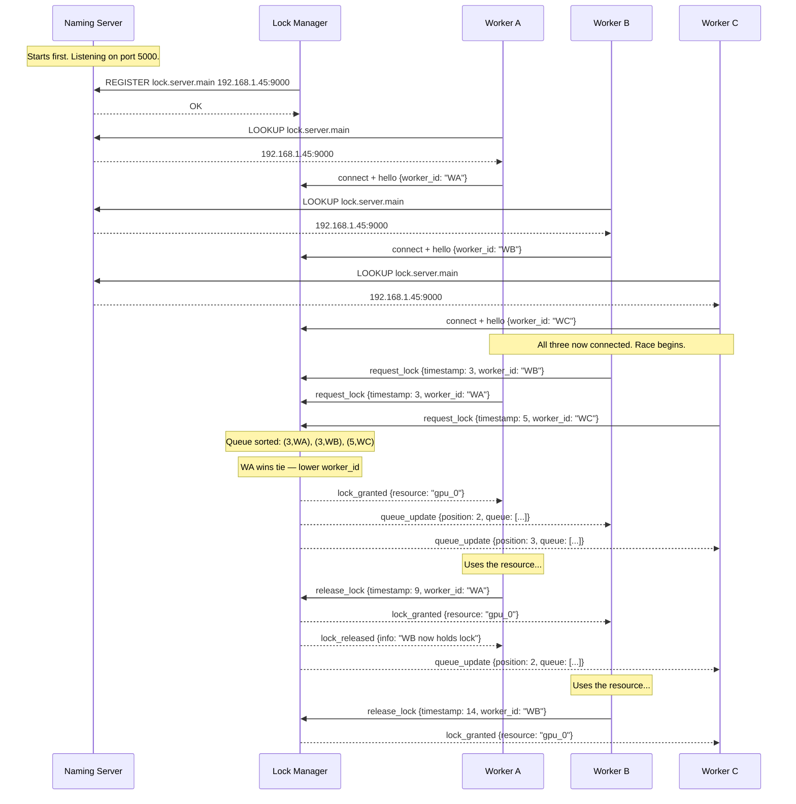
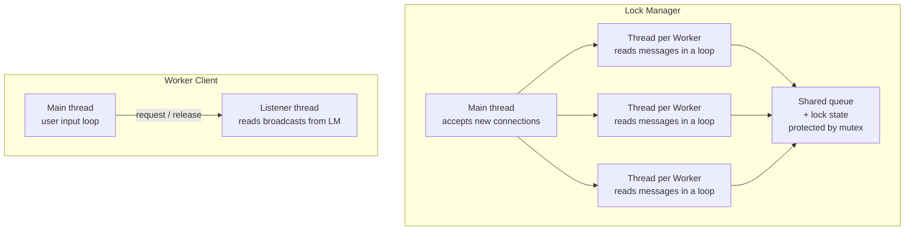

# Distributed Cloud Resource Lock Manager — Concepts & Architecture

---

## Part 1: Background Concepts

### 1.1 What is a Distributed System?

A distributed system is a collection of independent computers that appear to the user as a single coherent system. The machines communicate only by passing messages over a network. This creates three fundamental problems that your project is designed to solve:

- **No shared clock** — each machine has its own clock, and they drift apart. You cannot use wall-clock time to order events reliably.
- **No shared memory** — machines cannot read each other's variables. Everything must be communicated explicitly as a message.
- **Partial failures** — one machine can crash while others keep running. The system must handle this gracefully.

---

### 1.2 Mutual Exclusion (The Core Problem)

Mutual exclusion means: _at any given moment, only one process may use a shared resource_. In a single computer, you use a mutex or semaphore. In a distributed system, there is no such primitive — you must build it yourself through message passing.

The naive approach — "whoever asks first gets it" — fails because "first" is meaningless when clocks disagree.

```
Process A thinks it sent its request at T=5
Process B thinks it sent its request at T=5
Who goes first? You cannot tell from wall-clock time alone.
```

This is why you need Lamport Clocks.

---

### 1.3 Lamport Logical Clocks

Leslie Lamport's insight (1978): you do not need to know the _real_ time. You only need to know the _causal order_ of events — whether event A _caused_ or _happened before_ event B.

**The three rules:**

```
Rule 1 — Local event:
    Before any local event, increment your clock.
    clock = clock + 1

Rule 2 — Send:
    Before sending a message, increment your clock.
    Attach the clock value to the message.
    clock = clock + 1 ; send(message, clock)

Rule 3 — Receive:
    When you receive a message with timestamp T:
    clock = max(my_clock, T) + 1
```

**Why this works:** If event A causally preceded event B (A's message was the reason B happened), then A's timestamp will always be strictly less than B's timestamp, regardless of which machine's physical clock is faster.

**The tie-breaking problem:** Two events may end up with the same Lamport timestamp if they happened on different machines with no causal link. You break ties using a secondary key — typically the process ID. The rule becomes:

```
(timestamp_A, pid_A) < (timestamp_B, pid_B)
    if timestamp_A < timestamp_B
    OR (timestamp_A == timestamp_B AND pid_A < pid_B)
```

---

### 1.4 The Naming Problem (Location Independence)

Hardcoding an IP address like `192.168.1.45:9000` into your client is brittle. If the server restarts on a different port, every client breaks. A **Naming Server** (analogous to DNS) decouples the _logical name_ of a service from its _physical location_:

```
Logical name:   lock.server.main
Physical addr:  192.168.1.45:9000   ← this can change; the name does not
```

Clients always look up the name. The server registers its address. When the server moves, it re-registers. Clients are never aware the address changed.

---

### 1.5 Message-Oriented Communication

Instead of direct function calls (RPC), processes communicate by sending and receiving discrete **messages**. This is inherently asynchronous — the sender does not wait frozen for a response. It sends a message and continues doing other work.

**Why JSON?** JSON is self-describing, human-readable, and easy to parse in Python. Every message in your system should carry a `type` field so the receiver knows what to do with it:

```json
{ "type": "request_lock", "worker_id": "W1", "timestamp": 7, "resource": "gpu_0" }
{ "type": "lock_granted", "resource": "gpu_0", "holder": "W1" }
{ "type": "release_lock", "worker_id": "W1", "timestamp": 12 }
{ "type": "queue_update", "queue": [["W1", 7], ["W3", 9], ["W2", 11]] }
```

---

### 1.6 The Lock Queue Algorithm (Lamport's Mutual Exclusion)

Your Lock Manager implements a simplified version of Lamport's distributed mutual exclusion algorithm:

1. Worker sends a `request_lock` message with its Lamport timestamp.
2. Lock Manager adds the request to a priority queue, sorted by `(timestamp, worker_id)`.
3. Lock Manager grants the lock to whoever is at the front of the queue.
4. When that worker sends `release_lock`, it is removed from the queue.
5. The next worker in line is granted the lock.
6. All workers receive a `queue_update` broadcast so they can display their position.

The lock is **exclusive** — only one worker holds it at a time. All others wait in a fair, deterministic order determined by their Lamport timestamps, not by who physically arrived first at the server.

---

## Part 2: Optimal System Architecture

### 2.1 The Three-Process Model

Your system has exactly three types of processes. Each runs as a separate Python program, potentially on a separate machine.

<svg width="100%" viewBox="0 0 680 520" role="img" xmlns="http://www.w3.org/2000/svg" style="">
  <title style="fill:rgb(0, 0, 0);stroke:none;color:rgb(255, 255, 255);stroke-width:1px;stroke-linecap:butt;stroke-linejoin:miter;opacity:1;font-family:&quot;Anthropic Sans&quot;, -apple-system, BlinkMacSystemFont, &quot;Segoe UI&quot;, sans-serif;font-size:16px;font-weight:400;text-anchor:start;dominant-baseline:auto">DCRLM three-process architecture</title>
  <desc style="fill:rgb(0, 0, 0);stroke:none;color:rgb(255, 255, 255);stroke-width:1px;stroke-linecap:butt;stroke-linejoin:miter;opacity:1;font-family:&quot;Anthropic Sans&quot;, -apple-system, BlinkMacSystemFont, &quot;Segoe UI&quot;, sans-serif;font-size:16px;font-weight:400;text-anchor:start;dominant-baseline:auto">Three tiers: Naming Server at top, Lock Manager in middle, three Worker clients at bottom. Arrows show registration, lookup, and lock request flows.</desc>
  <defs>
    <marker id="arrow" viewBox="0 0 10 10" refX="8" refY="5" markerWidth="6" markerHeight="6" orient="auto-start-reverse">
      <path d="M2 1L8 5L2 9" fill="none" stroke="context-stroke" stroke-width="1.5" stroke-linecap="round" stroke-linejoin="round"/>
    </marker>
  <mask id="imagine-text-gaps-wkkpmo" maskUnits="userSpaceOnUse"><rect x="0" y="0" width="680" height="520" fill="white"/><rect x="286.88543701171875" y="42.212120056152344" width="106.22917175292969" height="21.57575798034668" fill="black" rx="2"/><rect x="254.87783813476562" y="63.42424011230469" width="170.24432373046875" height="19.15151596069336" fill="black" rx="2"/><rect x="288.9971618652344" y="212.2121124267578" width="102.00568389892578" height="21.57575798034668" fill="black" rx="2"/><rect x="253.95928955078125" y="233.4242401123047" width="172.08145141601562" height="19.15151596069336" fill="black" rx="2"/><rect x="85.63068389892578" y="411.2121276855469" width="68.73863983154297" height="21.57575798034668" fill="black" rx="2"/><rect x="68.98295593261719" y="430.42425537109375" width="102.03409576416016" height="19.15151596069336" fill="black" rx="2"/><rect x="305.4886474609375" y="411.2121276855469" width="69.0227279663086" height="21.57575798034668" fill="black" rx="2"/><rect x="288.98297119140625" y="430.42425537109375" width="102.03409576416016" height="19.15151596069336" fill="black" rx="2"/><rect x="524.75" y="411.2121276855469" width="70.5" height="21.57575798034668" fill="black" rx="2"/><rect x="508.98297119140625" y="430.42425537109375" width="102.03409576416016" height="19.15151596069336" fill="black" rx="2"/><rect x="354.45074462890625" y="133.4242401123047" width="99.0984878540039" height="19.15151596069336" fill="black" rx="2"/><rect x="262.3257751464844" y="331.48486328125" width="155.34849548339844" height="19.15151596069336" fill="black" rx="2"/><rect x="70" y="486.4242248535156" width="107.57386779785156" height="19.15151596069336" fill="black" rx="2"/><rect x="250.00001525878906" y="486.4242248535156" width="143.20831298828125" height="19.15151596069336" fill="black" rx="2"/></mask></defs>

  <!-- Naming Server -->
  <g onclick="sendPrompt('How does the Naming Server work?')" style="fill:rgb(0, 0, 0);stroke:none;color:rgb(255, 255, 255);stroke-width:1px;stroke-linecap:butt;stroke-linejoin:miter;opacity:1;font-family:&quot;Anthropic Sans&quot;, -apple-system, BlinkMacSystemFont, &quot;Segoe UI&quot;, sans-serif;font-size:16px;font-weight:400;text-anchor:start;dominant-baseline:auto">
    <rect x="220" y="30" width="240" height="60" rx="8" stroke-width="0.5" style="fill:rgb(8, 80, 65);stroke:rgb(93, 202, 165);color:rgb(255, 255, 255);stroke-width:0.5px;stroke-linecap:butt;stroke-linejoin:miter;opacity:1;font-family:&quot;Anthropic Sans&quot;, -apple-system, BlinkMacSystemFont, &quot;Segoe UI&quot;, sans-serif;font-size:16px;font-weight:400;text-anchor:start;dominant-baseline:auto"/>
    <text x="340" y="53" text-anchor="middle" dominant-baseline="central" style="fill:rgb(159, 225, 203);stroke:none;color:rgb(255, 255, 255);stroke-width:1px;stroke-linecap:butt;stroke-linejoin:miter;opacity:1;font-family:&quot;Anthropic Sans&quot;, -apple-system, BlinkMacSystemFont, &quot;Segoe UI&quot;, sans-serif;font-size:14px;font-weight:500;text-anchor:middle;dominant-baseline:central">Naming Server</text>
    <text x="340" y="73" text-anchor="middle" dominant-baseline="central" style="fill:rgb(93, 202, 165);stroke:none;color:rgb(255, 255, 255);stroke-width:1px;stroke-linecap:butt;stroke-linejoin:miter;opacity:1;font-family:&quot;Anthropic Sans&quot;, -apple-system, BlinkMacSystemFont, &quot;Segoe UI&quot;, sans-serif;font-size:12px;font-weight:400;text-anchor:middle;dominant-baseline:central">naming_server.py · port 5000</text>
  </g>

  <!-- Lock Manager -->
  <g onclick="sendPrompt('How does the Lock Manager work?')" style="fill:rgb(0, 0, 0);stroke:none;color:rgb(255, 255, 255);stroke-width:1px;stroke-linecap:butt;stroke-linejoin:miter;opacity:1;font-family:&quot;Anthropic Sans&quot;, -apple-system, BlinkMacSystemFont, &quot;Segoe UI&quot;, sans-serif;font-size:16px;font-weight:400;text-anchor:start;dominant-baseline:auto">
    <rect x="220" y="200" width="240" height="60" rx="8" stroke-width="0.5" style="fill:rgb(60, 52, 137);stroke:rgb(175, 169, 236);color:rgb(255, 255, 255);stroke-width:0.5px;stroke-linecap:butt;stroke-linejoin:miter;opacity:1;font-family:&quot;Anthropic Sans&quot;, -apple-system, BlinkMacSystemFont, &quot;Segoe UI&quot;, sans-serif;font-size:16px;font-weight:400;text-anchor:start;dominant-baseline:auto"/>
    <text x="340" y="223" text-anchor="middle" dominant-baseline="central" style="fill:rgb(206, 203, 246);stroke:none;color:rgb(255, 255, 255);stroke-width:1px;stroke-linecap:butt;stroke-linejoin:miter;opacity:1;font-family:&quot;Anthropic Sans&quot;, -apple-system, BlinkMacSystemFont, &quot;Segoe UI&quot;, sans-serif;font-size:14px;font-weight:500;text-anchor:middle;dominant-baseline:central">Lock Manager</text>
    <text x="340" y="243" text-anchor="middle" dominant-baseline="central" style="fill:rgb(175, 169, 236);stroke:none;color:rgb(255, 255, 255);stroke-width:1px;stroke-linecap:butt;stroke-linejoin:miter;opacity:1;font-family:&quot;Anthropic Sans&quot;, -apple-system, BlinkMacSystemFont, &quot;Segoe UI&quot;, sans-serif;font-size:12px;font-weight:400;text-anchor:middle;dominant-baseline:central">lock_server.py · dynamic port</text>
  </g>

  <!-- Worker A -->
  <g onclick="sendPrompt('What does a Worker client do?')" style="fill:rgb(0, 0, 0);stroke:none;color:rgb(255, 255, 255);stroke-width:1px;stroke-linecap:butt;stroke-linejoin:miter;opacity:1;font-family:&quot;Anthropic Sans&quot;, -apple-system, BlinkMacSystemFont, &quot;Segoe UI&quot;, sans-serif;font-size:16px;font-weight:400;text-anchor:start;dominant-baseline:auto">
    <rect x="40" y="400" width="160" height="56" rx="8" stroke-width="0.5" style="fill:rgb(99, 56, 6);stroke:rgb(239, 159, 39);color:rgb(255, 255, 255);stroke-width:0.5px;stroke-linecap:butt;stroke-linejoin:miter;opacity:1;font-family:&quot;Anthropic Sans&quot;, -apple-system, BlinkMacSystemFont, &quot;Segoe UI&quot;, sans-serif;font-size:16px;font-weight:400;text-anchor:start;dominant-baseline:auto"/>
    <text x="120" y="422" text-anchor="middle" dominant-baseline="central" style="fill:rgb(250, 199, 117);stroke:none;color:rgb(255, 255, 255);stroke-width:1px;stroke-linecap:butt;stroke-linejoin:miter;opacity:1;font-family:&quot;Anthropic Sans&quot;, -apple-system, BlinkMacSystemFont, &quot;Segoe UI&quot;, sans-serif;font-size:14px;font-weight:500;text-anchor:middle;dominant-baseline:central">Worker A</text>
    <text x="120" y="440" text-anchor="middle" dominant-baseline="central" style="fill:rgb(239, 159, 39);stroke:none;color:rgb(255, 255, 255);stroke-width:1px;stroke-linecap:butt;stroke-linejoin:miter;opacity:1;font-family:&quot;Anthropic Sans&quot;, -apple-system, BlinkMacSystemFont, &quot;Segoe UI&quot;, sans-serif;font-size:12px;font-weight:400;text-anchor:middle;dominant-baseline:central">worker_client.py</text>
  </g>

  <!-- Worker B -->
  <g onclick="sendPrompt('What does a Worker client do?')" style="fill:rgb(0, 0, 0);stroke:none;color:rgb(255, 255, 255);stroke-width:1px;stroke-linecap:butt;stroke-linejoin:miter;opacity:1;font-family:&quot;Anthropic Sans&quot;, -apple-system, BlinkMacSystemFont, &quot;Segoe UI&quot;, sans-serif;font-size:16px;font-weight:400;text-anchor:start;dominant-baseline:auto">
    <rect x="260" y="400" width="160" height="56" rx="8" stroke-width="0.5" style="fill:rgb(99, 56, 6);stroke:rgb(239, 159, 39);color:rgb(255, 255, 255);stroke-width:0.5px;stroke-linecap:butt;stroke-linejoin:miter;opacity:1;font-family:&quot;Anthropic Sans&quot;, -apple-system, BlinkMacSystemFont, &quot;Segoe UI&quot;, sans-serif;font-size:16px;font-weight:400;text-anchor:start;dominant-baseline:auto"/>
    <text x="340" y="422" text-anchor="middle" dominant-baseline="central" style="fill:rgb(250, 199, 117);stroke:none;color:rgb(255, 255, 255);stroke-width:1px;stroke-linecap:butt;stroke-linejoin:miter;opacity:1;font-family:&quot;Anthropic Sans&quot;, -apple-system, BlinkMacSystemFont, &quot;Segoe UI&quot;, sans-serif;font-size:14px;font-weight:500;text-anchor:middle;dominant-baseline:central">Worker B</text>
    <text x="340" y="440" text-anchor="middle" dominant-baseline="central" style="fill:rgb(239, 159, 39);stroke:none;color:rgb(255, 255, 255);stroke-width:1px;stroke-linecap:butt;stroke-linejoin:miter;opacity:1;font-family:&quot;Anthropic Sans&quot;, -apple-system, BlinkMacSystemFont, &quot;Segoe UI&quot;, sans-serif;font-size:12px;font-weight:400;text-anchor:middle;dominant-baseline:central">worker_client.py</text>
  </g>

  <!-- Worker C -->
  <g onclick="sendPrompt('What does a Worker client do?')" style="fill:rgb(0, 0, 0);stroke:none;color:rgb(255, 255, 255);stroke-width:1px;stroke-linecap:butt;stroke-linejoin:miter;opacity:1;font-family:&quot;Anthropic Sans&quot;, -apple-system, BlinkMacSystemFont, &quot;Segoe UI&quot;, sans-serif;font-size:16px;font-weight:400;text-anchor:start;dominant-baseline:auto">
    <rect x="480" y="400" width="160" height="56" rx="8" stroke-width="0.5" style="fill:rgb(99, 56, 6);stroke:rgb(239, 159, 39);color:rgb(255, 255, 255);stroke-width:0.5px;stroke-linecap:butt;stroke-linejoin:miter;opacity:1;font-family:&quot;Anthropic Sans&quot;, -apple-system, BlinkMacSystemFont, &quot;Segoe UI&quot;, sans-serif;font-size:16px;font-weight:400;text-anchor:start;dominant-baseline:auto"/>
    <text x="560" y="422" text-anchor="middle" dominant-baseline="central" style="fill:rgb(250, 199, 117);stroke:none;color:rgb(255, 255, 255);stroke-width:1px;stroke-linecap:butt;stroke-linejoin:miter;opacity:1;font-family:&quot;Anthropic Sans&quot;, -apple-system, BlinkMacSystemFont, &quot;Segoe UI&quot;, sans-serif;font-size:14px;font-weight:500;text-anchor:middle;dominant-baseline:central">Worker C</text>
    <text x="560" y="440" text-anchor="middle" dominant-baseline="central" style="fill:rgb(239, 159, 39);stroke:none;color:rgb(255, 255, 255);stroke-width:1px;stroke-linecap:butt;stroke-linejoin:miter;opacity:1;font-family:&quot;Anthropic Sans&quot;, -apple-system, BlinkMacSystemFont, &quot;Segoe UI&quot;, sans-serif;font-size:12px;font-weight:400;text-anchor:middle;dominant-baseline:central">worker_client.py</text>
  </g>

  <!-- LM registers with NS (solid, bidirectional) -->
  <line x1="340" y1="90" x2="340" y2="198" stroke="var(--color-border-primary)" stroke-width="1" fill="none" marker-end="url(#arrow)" marker-start="url(#arrow)" style="fill:none;stroke:rgba(222, 220, 209, 0.4);color:rgb(255, 255, 255);stroke-width:1px;stroke-linecap:butt;stroke-linejoin:miter;opacity:1;font-family:&quot;Anthropic Sans&quot;, -apple-system, BlinkMacSystemFont, &quot;Segoe UI&quot;, sans-serif;font-size:16px;font-weight:400;text-anchor:start;dominant-baseline:auto"/>
  <rect x="348" y="132" width="112" height="16" rx="3" fill="var(--color-background-primary)" style="fill:rgb(48, 48, 46);stroke:none;color:rgb(255, 255, 255);stroke-width:1px;stroke-linecap:butt;stroke-linejoin:miter;opacity:1;font-family:&quot;Anthropic Sans&quot;, -apple-system, BlinkMacSystemFont, &quot;Segoe UI&quot;, sans-serif;font-size:16px;font-weight:400;text-anchor:start;dominant-baseline:auto"/>
  <text x="404" y="143" text-anchor="middle" dominant-baseline="central" style="fill:rgb(194, 192, 182);stroke:none;color:rgb(255, 255, 255);stroke-width:1px;stroke-linecap:butt;stroke-linejoin:miter;opacity:1;font-family:&quot;Anthropic Sans&quot;, -apple-system, BlinkMacSystemFont, &quot;Segoe UI&quot;, sans-serif;font-size:12px;font-weight:400;text-anchor:middle;dominant-baseline:central">register / lookup</text>

  <!-- Worker A lookup NS: L-shaped polyline, no fill possible -->
  <polyline points="120,400 120,160 220,160 220,90" fill="none" stroke="var(--color-border-secondary)" stroke-width="1" stroke-dasharray="5 4" marker-end="url(#arrow)" style="fill:none;stroke:rgba(222, 220, 209, 0.3);color:rgb(255, 255, 255);stroke-width:1px;stroke-dasharray:5px, 4px;stroke-linecap:butt;stroke-linejoin:miter;opacity:1;font-family:&quot;Anthropic Sans&quot;, -apple-system, BlinkMacSystemFont, &quot;Segoe UI&quot;, sans-serif;font-size:16px;font-weight:400;text-anchor:start;dominant-baseline:auto"/>

  <!-- Worker C lookup NS: L-shaped polyline -->
  <polyline points="560,400 560,160 460,160 460,90" fill="none" stroke="var(--color-border-secondary)" stroke-width="1" stroke-dasharray="5 4" marker-end="url(#arrow)" style="fill:none;stroke:rgba(222, 220, 209, 0.3);color:rgb(255, 255, 255);stroke-width:1px;stroke-dasharray:5px, 4px;stroke-linecap:butt;stroke-linejoin:miter;opacity:1;font-family:&quot;Anthropic Sans&quot;, -apple-system, BlinkMacSystemFont, &quot;Segoe UI&quot;, sans-serif;font-size:16px;font-weight:400;text-anchor:start;dominant-baseline:auto"/>

  <!-- Worker B lookup NS: straight up through gap -->
  <polyline points="340,400 340,310 260,310 260,260" fill="none" stroke="var(--color-border-secondary)" stroke-width="1" stroke-dasharray="5 4" marker-end="url(#arrow)" mask="url(#imagine-text-gaps-wkkpmo)" style="fill:none;stroke:rgba(222, 220, 209, 0.3);color:rgb(255, 255, 255);stroke-width:1px;stroke-dasharray:5px, 4px;stroke-linecap:butt;stroke-linejoin:miter;opacity:1;font-family:&quot;Anthropic Sans&quot;, -apple-system, BlinkMacSystemFont, &quot;Segoe UI&quot;, sans-serif;font-size:16px;font-weight:400;text-anchor:start;dominant-baseline:auto"/>

  <!-- Workers connect to Lock Manager (solid lines) -->
  <line x1="180" y1="400" x2="268" y2="262" fill="none" stroke="var(--color-border-primary)" stroke-width="1" marker-end="url(#arrow)" style="fill:none;stroke:rgba(222, 220, 209, 0.4);color:rgb(255, 255, 255);stroke-width:1px;stroke-linecap:butt;stroke-linejoin:miter;opacity:1;font-family:&quot;Anthropic Sans&quot;, -apple-system, BlinkMacSystemFont, &quot;Segoe UI&quot;, sans-serif;font-size:16px;font-weight:400;text-anchor:start;dominant-baseline:auto"/>
  <line x1="340" y1="400" x2="340" y2="262" fill="none" stroke="var(--color-border-primary)" stroke-width="1" marker-end="url(#arrow)" mask="url(#imagine-text-gaps-wkkpmo)" style="fill:none;stroke:rgba(222, 220, 209, 0.4);color:rgb(255, 255, 255);stroke-width:1px;stroke-linecap:butt;stroke-linejoin:miter;opacity:1;font-family:&quot;Anthropic Sans&quot;, -apple-system, BlinkMacSystemFont, &quot;Segoe UI&quot;, sans-serif;font-size:16px;font-weight:400;text-anchor:start;dominant-baseline:auto"/>
  <line x1="480" y1="400" x2="412" y2="262" fill="none" stroke="var(--color-border-primary)" stroke-width="1" marker-end="url(#arrow)" style="fill:none;stroke:rgba(222, 220, 209, 0.4);color:rgb(255, 255, 255);stroke-width:1px;stroke-linecap:butt;stroke-linejoin:miter;opacity:1;font-family:&quot;Anthropic Sans&quot;, -apple-system, BlinkMacSystemFont, &quot;Segoe UI&quot;, sans-serif;font-size:16px;font-weight:400;text-anchor:start;dominant-baseline:auto"/>

  <!-- Label: lock requests -->
  <text x="340" y="345" text-anchor="middle" style="fill:rgb(194, 192, 182);stroke:none;color:rgb(255, 255, 255);stroke-width:1px;stroke-linecap:butt;stroke-linejoin:miter;opacity:1;font-family:&quot;Anthropic Sans&quot;, -apple-system, BlinkMacSystemFont, &quot;Segoe UI&quot;, sans-serif;font-size:12px;font-weight:400;text-anchor:middle;dominant-baseline:auto">lock requests · broadcasts</text>

  <!-- Legend -->
  <line x1="40" y1="492" x2="68" y2="492" fill="none" stroke="var(--color-border-primary)" stroke-width="1" style="fill:none;stroke:rgba(222, 220, 209, 0.4);color:rgb(255, 255, 255);stroke-width:1px;stroke-linecap:butt;stroke-linejoin:miter;opacity:1;font-family:&quot;Anthropic Sans&quot;, -apple-system, BlinkMacSystemFont, &quot;Segoe UI&quot;, sans-serif;font-size:16px;font-weight:400;text-anchor:start;dominant-baseline:auto"/>
  <text x="74" y="496" dominant-baseline="central" style="fill:rgb(194, 192, 182);stroke:none;color:rgb(255, 255, 255);stroke-width:1px;stroke-linecap:butt;stroke-linejoin:miter;opacity:1;font-family:&quot;Anthropic Sans&quot;, -apple-system, BlinkMacSystemFont, &quot;Segoe UI&quot;, sans-serif;font-size:12px;font-weight:400;text-anchor:start;dominant-baseline:central">direct TCP socket</text>
  <line x1="220" y1="492" x2="248" y2="492" fill="none" stroke="var(--color-border-secondary)" stroke-width="1" stroke-dasharray="5 4" style="fill:none;stroke:rgba(222, 220, 209, 0.3);color:rgb(255, 255, 255);stroke-width:1px;stroke-dasharray:5px, 4px;stroke-linecap:butt;stroke-linejoin:miter;opacity:1;font-family:&quot;Anthropic Sans&quot;, -apple-system, BlinkMacSystemFont, &quot;Segoe UI&quot;, sans-serif;font-size:16px;font-weight:400;text-anchor:start;dominant-baseline:auto"/>
  <text x="254" y="496" dominant-baseline="central" style="fill:rgb(194, 192, 182);stroke:none;color:rgb(255, 255, 255);stroke-width:1px;stroke-linecap:butt;stroke-linejoin:miter;opacity:1;font-family:&quot;Anthropic Sans&quot;, -apple-system, BlinkMacSystemFont, &quot;Segoe UI&quot;, sans-serif;font-size:12px;font-weight:400;text-anchor:start;dominant-baseline:central">lookup only (on startup)</text>
</svg>

---

### 2.2 Component Breakdown

#### `naming_server.py` — The Directory

Runs first, always. Stays running for the entire session. It holds a dictionary:

```python
registry = {
    "lock.server.main": ("192.168.1.45", 9000)
}
```

It handles two request types:

- `REGISTER lock.server.main 192.168.1.45 9000` — Lock Manager calls this on startup (and on restart).
- `LOOKUP lock.server.main` — Workers call this to find the Lock Manager.

Its port is the **only** hardcoded value in the entire system — and even that can be passed as a command-line argument.

---

#### `lock_server.py` — The Lock Manager

This is the central engine. On startup it registers itself with the Naming Server. Then it runs two concurrent loops:

- **Accept loop** — accepts new TCP connections from Workers.
- **Message loop** — reads incoming JSON messages from all connected Workers.

Its internal state is:

```python
lock_queue   = []        # priority queue of (timestamp, worker_id)
lock_holder  = None      # which worker currently holds the lock
clients      = {}        # worker_id -> socket
lamport_clock = 0
```

When it receives a `request_lock` message, it applies Lamport Rule 3 to update its clock, pushes the request into the queue, re-sorts the queue, and if no one holds the lock, grants it immediately.

---

#### `worker_client.py` — The Worker

Each Worker is an interactive terminal. On startup:

1. Connects to the Naming Server to resolve `lock.server.main`.
2. Opens a TCP connection to the Lock Manager.
3. Sends a `hello` message to register its `worker_id`.
4. Starts a background thread that listens for broadcasts from the Lock Manager (queue updates, lock granted, lock released).
5. Main thread runs an input loop where the user can request the lock, use the resource, and release the lock.

---

#### `utils.py` — Shared Library

Imported by all three programs. Contains:

- `LamportClock` class — thread-safe, with `tick()`, `send()`, `receive(ts)` methods.
- `send_json(sock, msg)` — serializes and sends a JSON message with a length header.
- `recv_json(sock)` — receives and deserializes a JSON message.
- Message type constants.

---

### 2.3 Full Data & Process Flow



---

### 2.4 The Lamport Clock in Action (Zoomed In)

This is the critical section. WA and WB both send `request_lock` at Lamport timestamp 3. Here is what happens step by step inside the Lock Manager:

```
Initial state:  LM clock = 0

1. LM receives {type: "request_lock", timestamp: 3, worker_id: "WB"}
   Apply Rule 3:  LM clock = max(0, 3) + 1 = 4
   Queue: [(3, "WB")]

2. LM receives {type: "request_lock", timestamp: 3, worker_id: "WA"}
   Apply Rule 3:  LM clock = max(4, 3) + 1 = 5
   Queue: [(3, "WA"), (3, "WB")]   ← sorted by (ts, id); "WA" < "WB"

3. LM receives {type: "request_lock", timestamp: 5, worker_id: "WC"}
   Apply Rule 3:  LM clock = max(5, 5) + 1 = 6
   Queue: [(3, "WA"), (3, "WB"), (5, "WC")]

4. No one holds the lock. Front of queue = (3, "WA").
   LM clock = 6 + 1 = 7  (local event: granting lock)
   Send lock_granted to WA.
   lock_holder = "WA"

5. WA sends release_lock {timestamp: 9}
   Apply Rule 3:  LM clock = max(7, 9) + 1 = 10
   Remove "WA" from queue.
   Front of queue = (3, "WB").
   Send lock_granted to WB.
   lock_holder = "WB"
```

The key point: even if WA's `request_lock` message _arrived at the server after_ WB's, the Lamport timestamp of 3 with `worker_id: "WA"` still sorts ahead of `(3, "WB")`. Physical arrival order does not matter. Logical order does.

---

### 2.5 Thread Architecture Per Process

Because sockets are blocking, each process needs multiple threads:



The `threading.Lock()` around the queue and `lock_holder` state in the Lock Manager is critical. Without it, two worker threads could simultaneously read and modify the queue, causing a race condition inside the very program meant to prevent race conditions.

---

### 2.6 JSON Message Schema (Complete)

|Direction|`type`|Required fields|
|---|---|---|
|Worker → LM|`hello`|`worker_id`|
|Worker → LM|`request_lock`|`worker_id`, `timestamp`, `resource`|
|Worker → LM|`release_lock`|`worker_id`, `timestamp`|
|LM → Worker|`lock_granted`|`resource`, `holder`, `timestamp`|
|LM → Worker|`lock_released`|`next_holder`, `timestamp`|
|LM → Worker|`queue_update`|`queue` (list of `[worker_id, timestamp]`), `your_position`|
|LM → Worker|`error`|`message`|
|LM ↔ NS|`register`|`name`, `ip`, `port`|
|Worker ↔ NS|`lookup`|`name`|
|NS → any|`lookup_response`|`ip`, `port`|

---

### 2.7 Startup Order

This is non-negotiable. If you start them in the wrong order, the system fails before it begins.

```
1. naming_server.py        ← must be running before anything else
2. lock_server.py          ← registers itself; must be up before workers connect
3. worker_client.py × N    ← any order, any number
```

---

### 2.8 Member-to-Component Mapping

|Member|Primary file|What they own|
|---|---|---|
|1 — Registry Architect|`naming_server.py`|The full naming server: register, lookup, handle re-registration|
|2 — Middleware Engineer|`utils.py` (sockets)|`send_json`, `recv_json`, message framing, connection handling|
|3 — Timekeeper|`utils.py` (clock) + LM queue logic|`LamportClock` class, queue sort, grant/release decision|
|4 — Client Developer|`worker_client.py`|Terminal UI, listener thread, clock integration on client side|
|5 — Server Developer|`lock_server.py`|Accept loop, per-worker threads, integrating Members 2 & 3|

---

### 2.9 Key Risks and How to Avoid Them

**Race condition on the queue.** If two worker threads both call `queue.push()` simultaneously, the queue corrupts. Wrap all reads and writes to `lock_queue` and `lock_holder` in a `threading.Lock()`. Acquire it, do your operation, release it. This is the single most important implementation detail.

**Framing broken messages.** TCP is a stream, not a message protocol. If you call `socket.recv(4096)` you might get half a JSON object, or two JSON objects merged together. The standard fix is a length-prefix: send 4 bytes containing the message length, then the message. `recv_json` reads 4 bytes first, then reads exactly that many bytes. Member 2 owns this.

**Worker disconnect.** If a Worker holding the lock crashes without sending `release_lock`, the lock is held forever. A robust fix is to wrap each per-worker thread in a `try/except` that detects a closed socket and automatically releases the lock if that worker was the holder.

**Naming Server as single point of failure.** The Naming Server is only needed at startup (registration and lookup). Once Workers have the Lock Manager's address, they do not need the Naming Server again. For the scope of this project, this is acceptable.