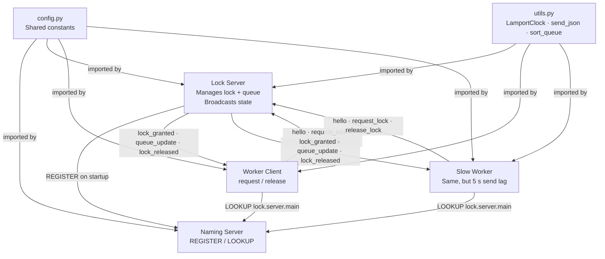
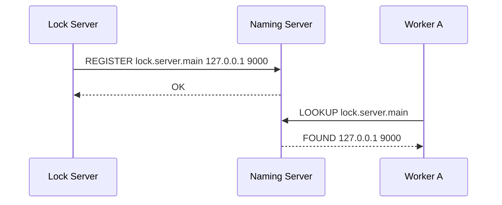
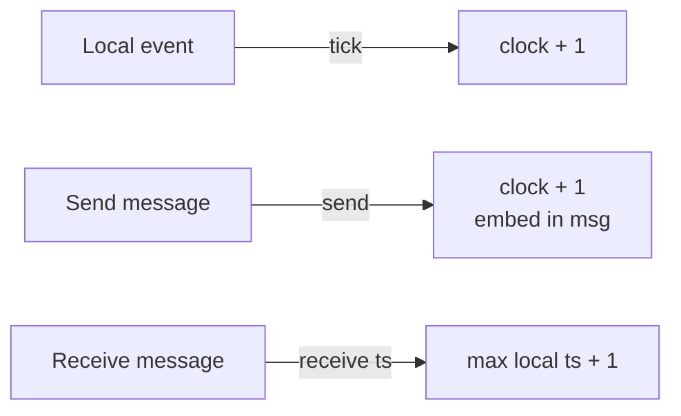
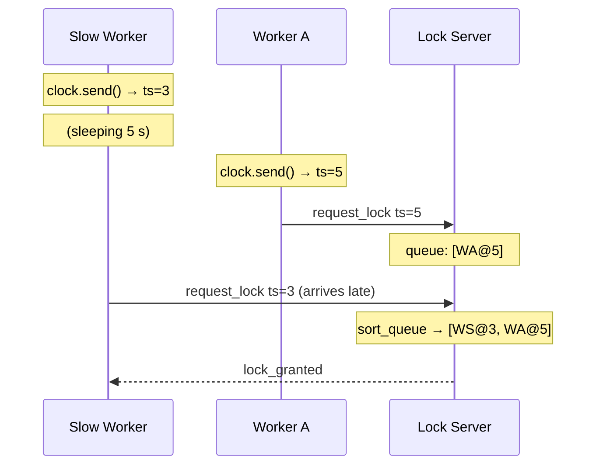
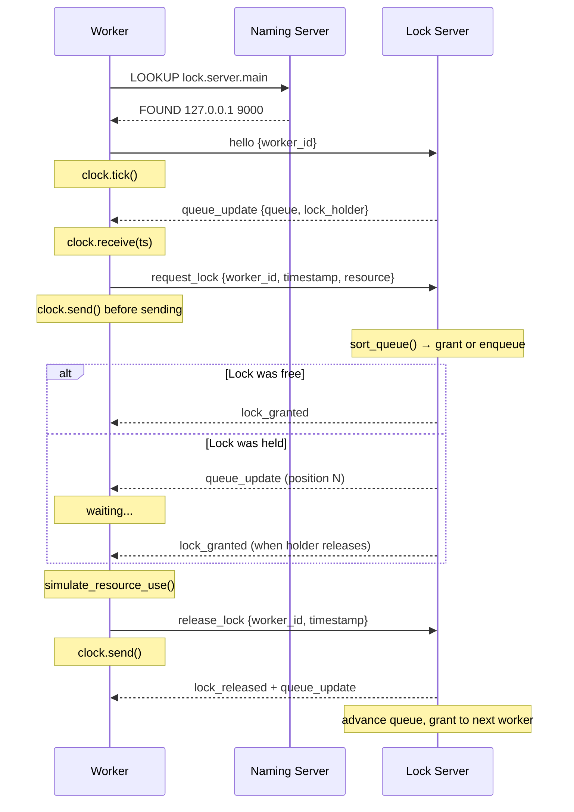
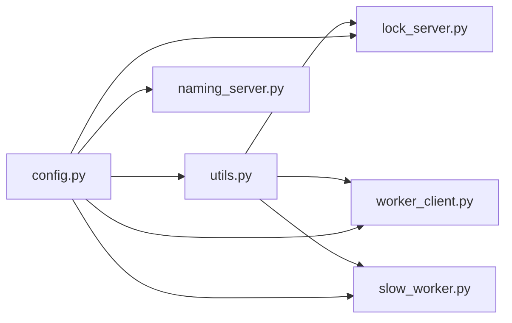

# Distributed Lock Manager — System Walkthrough

## What is this system?

This is a **distributed lock manager**. Multiple worker processes compete for exclusive access to a shared resource (`GPU-RESOURCE`). Only one worker can hold the lock at a time. The order of access is decided fairly using **Lamport logical clocks** — not by who sends their request first over the network.

---

## The five components

|Module|Role|
|---|---|
|`config.py`|Shared constants (addresses, ports, timeouts)|
|`naming_server.py`|Service registry — REGISTER / LOOKUP|
|`utils.py`|Shared library — networking, Lamport clock, queue helpers|
|`lock_server.py`|Central coordinator — manages the lock and queue|
|`worker_client.py` / `slow_worker.py`|Clients — request and release the lock|

---

## System architecture



---

## Module by module

### `config.py`

The single source of truth for all system-wide settings. Every other module imports from it. Nothing runs without it.

Key values:

- `NAMING_SERVER_HOST / PORT` — where the naming server listens (`127.0.0.1:5000`)
- `LOCK_SERVER_NAME` — the logical name the lock server registers under (`lock.server.main`)
- `LOCK_MAX_HOLD_SEC` — how long a worker may hold the lock before the watchdog forcibly releases it (30 s)
- `SHARED_RESOURCE_NAME` — the resource being protected (`GPU-RESOURCE`)

---

### `naming_server.py`

A lightweight TCP service registry. It has no knowledge of the lock protocol — it only maps logical names to `(ip, port)` pairs.

**Two operations:**

- `REGISTER lock.server.main <ip> <port>` → `OK`
- `LOOKUP lock.server.main` → `FOUND <ip> <port>` or `NOT_FOUND`

**Design note:** Keeping the naming server thin means the lock server can move to any machine and port without breaking anything — it just re-registers on startup.



---

### `utils.py`

The shared library. Three areas of responsibility:

#### 1. Networking helpers

| Function               | What it does                                                                     |
| ---------------------- | -------------------------------------------------------------------------------- |
| `send_json(sock, msg)` | Serialises a dict to JSON, prefixes with a 4-byte length header, sends over TCP  |
| `recv_json(sock)`      | Reads the 4-byte header, then reads exactly that many bytes, returns parsed dict |
| `get_local_ip()`       | Connects a UDP socket to 8.8.8.8 (no traffic sent) to discover the local IP      |

The length-prefix framing in `send_json` / `recv_json` solves TCP's stream nature — without it, two back-to-back messages could be read as one blob.

#### 2. `LamportClock`

A thread-safe logical clock. Every worker and the lock server each hold one instance.

|Method|Rule|
|---|---|
|`tick()`|Local event — increment by 1|
|`send()`|Sending a message — increment, embed in message|
|`receive(ts)`|Receiving a message — `max(local, ts) + 1`|



#### 3. Queue and resource utilities

|Function|What it does|
|---|---|
|`sort_queue(queue)`|Sorts waiting workers by `(timestamp, worker_id)` — lowest timestamp wins; alphabetical ID breaks ties|
|`build_queue_update_msg(clock, holder, queue)`|Builds a `queue_update` message dict, ticking the clock|
|`simulate_resource_use(worker_id, resource, duration)`|Writes one log line per second to `resource_access.log` while the worker "uses" the resource|
|`check_lock_timeout(state, broadcast_fn)`|Watchdog — if the lock holder exceeded 30 s, forcibly releases and advances the queue|

---

### `lock_server.py`

The central coordinator. It:

1. Registers itself with the naming server on startup
2. Accepts TCP connections from workers
3. Maintains a sorted queue of lock requests
4. Grants the lock to the front of the queue
5. Broadcasts `lock_granted`, `lock_released`, and `queue_update` to all connected workers
6. Runs the `check_lock_timeout` watchdog on a timer

The lock server is the only node with a global view of the queue. Workers only know their own position.

---

### `worker_client.py`

Connects to the lock server and enters an interactive loop. Two threads run concurrently:

- **Listener thread** (daemon) — receives incoming messages from the lock server, updates local state, prints status
- **Input loop** (main thread) — reads user commands: `request`, `release`, `status`, `quit`

Local state tracked per worker:

```
holds_lock       bool    — whether this worker currently holds the lock
queue_position   int     — index in the queue (-1 = not in queue)
lock_holder      str     — which worker currently holds the lock
queue            list    — full queue snapshot from last queue_update
```

---

### `slow_worker.py`

Identical to `worker_client.py` except `send_request` sleeps **5 seconds** before sending — but stamps the Lamport timestamp _before_ sleeping.

This demonstrates the key property of Lamport clocks:

> A worker with a lower timestamp wins the queue even if its message arrives later.



---

## Full request lifecycle



---

## Module import map



---

## Key design decisions

**Why Lamport clocks instead of wall-clock time?** Wall clocks on different machines drift. A worker whose system clock is 2 seconds behind would always lose the race even if it requested first. Lamport clocks are purely logical — they measure causal ordering, not physical time.

**Why a naming server?** Decouples location from identity. Workers address the lock server by name (`lock.server.main`), not by IP. The lock server can restart on a different port and workers just look it up again.

**Why broadcast queue_update to everyone?** Every worker maintains a local copy of the queue. This lets any worker call `status` and see its position without querying the server — reducing load and round trips.

**Why release the state lock before broadcasting?** `check_lock_timeout` acquires `state_lock`, computes the new state, releases the lock, _then_ calls `broadcast_fn`. If it broadcast while holding the lock, a slow network write could block the lock server from processing any other request — a classic deadlock risk.